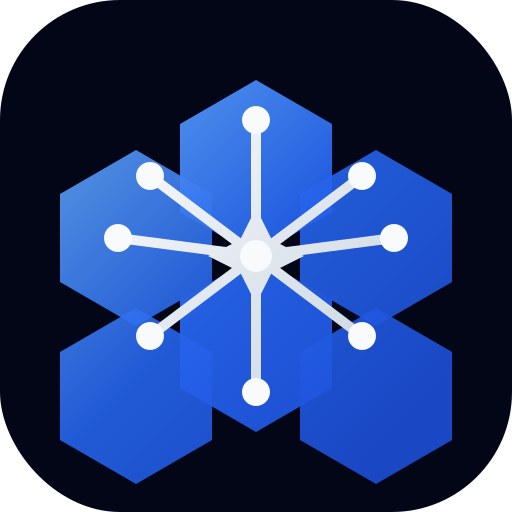

# ZamAI Web

Public website for ZamAI — home of Zeerak.

- Live: https://zamai.dev
- GitHub Pages: https://zamai-org.github.io (if applicable)


# ZamAI

<p align="center">
  
</p>

<p align="center">
  <strong>Home of Zeerak — the flagship AI assistant by ZamAI.</strong>
</p>

<p align="center">
  ZamAI is a growing AI ecosystem focused on intelligent assistants, tools, digital products, and future-facing experiences.
</p>

<p align="center">
  <a href="https://zamai.dev">
    
  </a>
  <a href="https://github.com/ZamAI/zamai.github.io">
    
  </a>
  
  
</p>

---

## Overview

**ZamAI** is the public-facing organization and ecosystem behind **Zeerak**, the flagship AI assistant by ZamAI.

This repository contains the official public website for ZamAI, including:
- the landing page
- public-facing product messaging
- brand presentation
- ecosystem positioning
- future docs and showcase surfaces

ZamAI provides a professional public home for the ecosystem, while Zeerak's private implementation remains separate.

## Brand Structure

- **ZamAI** → parent organization, ecosystem, and public identity
- **Zeerak** → flagship AI assistant by ZamAI

## Why ZamAI

ZamAI exists to unify:
- a strong public AI brand
- a flagship assistant product
- future tools and digital experiences
- a scalable ecosystem identity

## Live Website

- **Production:** https://zamai.dev

## Repository Purpose

This repository is intended for:
- public website development
- brand and messaging updates
- visual assets
- public ecosystem presentation
- future docs and static pages

This repository does **not** contain:
- Zeerak's private core source code
- private backend systems
- internal infrastructure
- private AI/model implementation

## Tech Stack

- HTML
- Tailwind CSS via CDN
- Vanilla JavaScript
- GitHub Pages

## Project Structure

```text
.
├── index.html
├── CNAME
├── README.md
└── assets/
    ├── favicon.svg
    ├── logo.svg
    └── og-image.svg
```

## Getting Started

### Clone the repository

```bash
git clone https://github.com/ZamAI/zamai.github.io.git
cd zamai.github.io
```

### Run locally

You can open `index.html` directly in the browser, or use a local server.

#### Python
```bash
python -m http.server 8080
```

Then visit:

```text
http://localhost:8080
```

## Deployment

The site is deployed using **GitHub Pages** from the default branch.

### Custom domain
- `zamai.dev`

### Required domain file
The `CNAME` file should contain:

```text
zamai.dev
```

## Making Changes Live

1. Update files
2. Commit and push to the default branch
3. Wait for GitHub Pages deployment
4. Refresh `https://zamai.dev`

## Accessibility and SEO

Current and planned improvements include:
- semantic HTML
- keyboard-friendly navigation
- proper metadata
- Open Graph preview support
- readable contrast
- branded custom domain
- structured content hierarchy

## Roadmap

- improved branding polish
- social preview image support
- dedicated Zeerak product page
- more public ecosystem pages
- docs and public launch materials
- future contact or waitlist flow

## FAQ

### Is Zeerak open source?
No. Zeerak is presented publicly as the flagship assistant by ZamAI, but its core implementation remains private.

### What is public here?
The ZamAI website, branding surfaces, and other public-facing web assets.

### What is ZamAI?
ZamAI is the organization and ecosystem behind Zeerak and future AI products.

## Contributors

Currently maintained as part of the ZamAI public launch setup.

## License

No license has been added yet.

## Summary

**ZamAI** is the public home of **Zeerak** and the foundation of a broader AI ecosystem.
This repository exists to present that identity clearly, professionally, and publicly.
